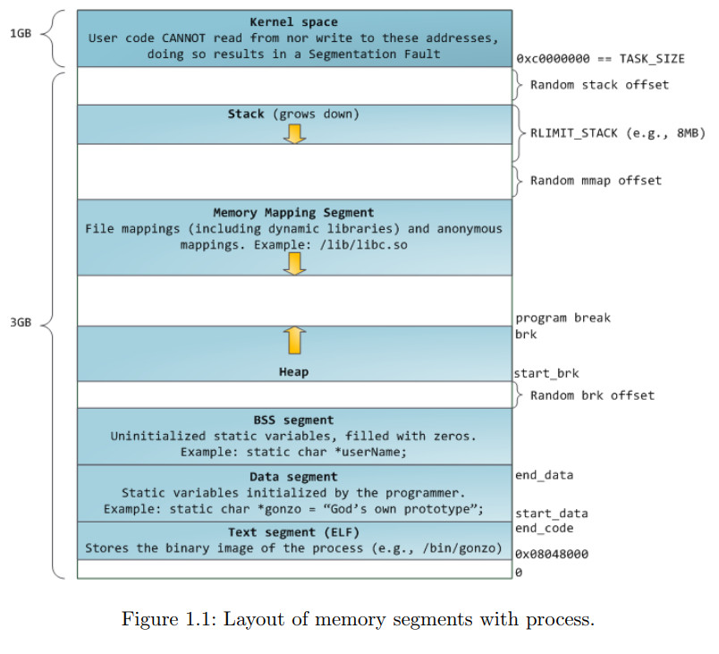
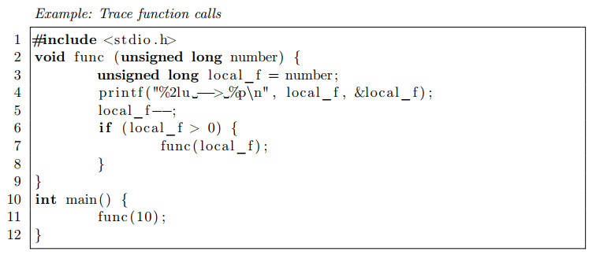
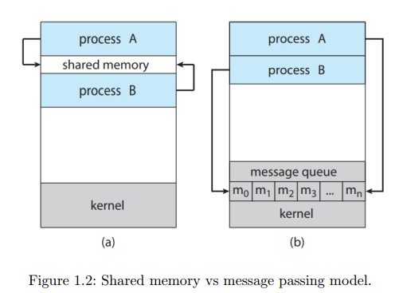
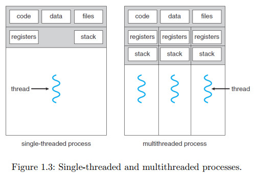
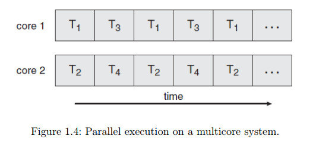
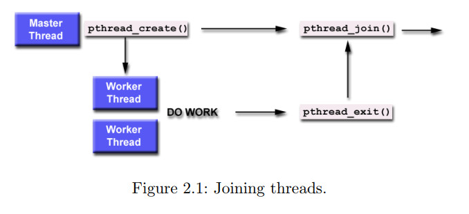

# Introduction
## Process’s memory
Theo truyền thống, một tiến trình Unix được chia thành các đoạn. Các đoạn tiêu chuẩn bao gồm đoạn mã (code segment), đoạn dữ liệu (data segment), đoạn BSS (block started by symbol) và đoạn ngăn xếp (stack segment).
Đoạn mã chứa mã nhị phân của chương trình đang chạy dưới dạng tiến trình (một "tiến trình" là một chương trình đang thực thi). Đoạn dữ liệu chứa các biến toàn cục được khởi tạo và cấu trúc dữ liệu. Đoạn BSS chứa các cấu trúc dữ liệu toàn cục chưa được khởi tạo và cuối cùng, đoạn ngăn xếp chứa các biến cục bộ, địa chỉ trả về, v.v. cho tiến trình cụ thể.
Trong Linux, một tiến trình có thể thực thi ở hai chế độ - chế độ người dùng và chế độ kernel. Một tiến trình thường thực thi ở chế độ người dùng, nhưng có thể chuyển sang chế độ kernel bằng cách thực hiện cuộc gọi hệ thống. Khi một tiến trình thực hiện cuộc gọi hệ thống, kernel lấy quyền điều khiển và thực hiện dịch vụ yêu cầu thay mặt cho tiến trình. Trong thời gian này, tiến trình được cho là đang chạy ở chế độ kernel. Khi một tiến trình đang chạy ở chế độ người dùng, nó được gọi là "in userland" và khi nó đang chạy ở chế độ kernel, nó được gọi là "in kernel space". Đầu tiên, chúng ta sẽ xem xét cách xử lý các đoạn tiến trình trong userland và sau đó xem xét việc theo dõi các đoạn tiến trình được thực hiện trong không gian kernel.
Trong Hình 1.1, các vùng màu xanh lá cây đại diện cho các địa chỉ ảo được ánh xạ thành bộ nhớ vật lý, trong khi các vùng trắng là không được ánh xạ. Các dải khác nhau trong không gian địa chỉ tương ứng với các đoạn bộ nhớ như heap, stack, v.v.

**Quan điểm của Userland về các đoạn (segments)**
- Đoạn mã (Code segment) bao gồm mã nguồn - chương trình thực thi thực tế. Mã của tất cả các chức năng mà chúng ta viết trong chương trình đều nằm trong đoạn này. Các địa chỉ của các chức năng sẽ cho chúng ta một ý tưởng về vị trí của đoạn mã. Nếu chúng ta có một chức năng func() và để p là địa chỉ của func() (p = &func;). Chúng ta biết rằng p sẽ trỏ đến bên trong đoạn mã.
- Đoạn dữ liệu (Data segment) bao gồm các biến toàn cục được khởi tạo của một chương trình. Hệ điều hành cần biết giá trị được sử dụng để khởi tạo các biến toàn cục. Các biến được khởi tạo được lưu trữ trong đoạn dữ liệu. Để lấy địa chỉ của đoạn dữ liệu, chúng ta khai báo một biến toàn cục và sau đó in địa chỉ của nó. Địa chỉ này phải nằm trong đoạn dữ liệu.
- Đoạn BSS bao gồm các biến toàn cục chưa được khởi tạo của một tiến trình. Để có được một địa chỉ xuất hiện trong đoạn BSS, chúng ta khai báo một biến toàn cục chưa được khởi tạo, sau đó in địa chỉ của nó.
- Các biến tự động (hoặc biến cục bộ) sẽ được phân bổ trên ngăn xếp (stack), vì vậy in địa chỉ của các biến cục bộ sẽ cung cấp cho chúng ta các địa chỉ trong đoạn ngăn xếp.
- Một tiến trình cũng có thể bao gồm một heap, là bộ nhớ được phân bổ động trong thời gian chạy của tiến trình.

## Stack
Stack là một trong những khu vực bộ nhớ quan trọng nhất của một tiến trình. Nó được sử dụng để lưu trữ dữ liệu tạm thời được sử dụng bởi tiến trình (hoặc luồng). Tên "stack" được sử dụng để mô tả cách dữ liệu được đưa vào và lấy ra từ khu vực này, tương tự như cấu trúc dữ liệu stack: Phần tử cuối cùng được đưa vào stack là phần tử đầu tiên được lấy ra (pop).

Tổ chức stack làm cho nó phù hợp để xử lý các lệnh gọi hàm. Mỗi khi một hàm được gọi, nó sẽ có một khung stack mới. Đây là một khu vực của bộ nhớ thường chứa, ít nhất là địa chỉ trả về khi hoàn thành, các đối số đầu vào cho hàm và không gian cho các biến cục bộ.

Trong Linux, stack bắt đầu từ một địa chỉ cao trong bộ nhớ và tăng dần xuống để tăng kích thước của nó. Mỗi khi một hàm mới được gọi, tiến trình sẽ tạo một khung stack mới cho hàm này. Khung này sẽ được đặt ngay sau khung của người gọi của nó. Khi hàm trả về, khung này sẽ bị xóa khỏi bộ nhớ bằng cách thu nhỏ stack (con trỏ stack tăng lên).

Chương trình sau đây minh họa cách xác định vị trí tương đối của các khung stack được tạo bởi các lệnh gọi hàm lồng nhau.


Tương tự như heap, stack có một con trỏ được gọi là stack pointer (như heap có program break) được sử dụng để chỉ định đỉnh của stack. Để thay đổi kích thước của stack, chúng ta phải thay đổi giá trị của con trỏ này. Thường thì, giá trị của con trỏ stack pointer được lưu trữ trong thanh ghi stack pointer bên trong bộ xử lý. Không gian stack có giới hạn, chúng ta không thể mở rộng stack vượt quá một kích thước nhất định. Nếu làm như vậy, stack overflow sẽ xảy ra và làm cho chương trình của chúng ta bị treo. Để xác định kích thước stack mặc định, sử dụng lệnh sau đây.
```shell
ulimit -s
```
Khác với heap, dữ liệu của stack được tự động cấp phát và dọn dẹp thông qua việc kết thúc các thủ tục gọi, do đó trong lập trình C, chúng ta không cần phải cấp phát và giải phóng các biến cục bộ. Trong Linux, một tiến trình được phép có nhiều vùng stack. Mỗi vùng này thuộc về một luồng (thread).

## Interprocess Communication
Các tiến trình trong hệ điều hành là độc lập nhưng chúng ta cũng cần chúng hợp tác. Hợp tác tiến trình có thể ảnh hưởng hoặc bị ảnh hưởng bởi các tiến trình khác, bao gồm chia sẻ dữ liệu. Một số lý do cho sự cần thiết của các tiến trình hợp tác như sau:

• Chia sẻ thông tin: Vì một số ứng dụng có thể quan tâm đến cùng một thông tin (ví dụ như sao chép và dán), chúng ta phải cung cấp môi trường cho phép truy cập đồng thời vào thông tin đó.

• Tăng tốc tính toán: Nếu chúng ta muốn một tác vụ cụ thể chạy nhanh hơn, chúng ta phải chia tác vụ đó thành các tác vụ con, mỗi tác vụ sẽ được thực thi song song với các tác vụ khác. Lưu ý rằng tăng tốc đó chỉ có thể đạt được nếu máy tính có nhiều lõi xử lý.

• Tính mô-đun: Chúng ta có thể muốn xây dựng hệ thống theo cách mô-đun, chia các chức năng hệ thống thành các tiến trình hoặc luồng riêng biệt.

Do đó, chúng ta cần các phương pháp truyền thông để chuyển dữ liệu giữa các tiến trình, còn được gọi là giao thức truyền thông giữa tiến trình (IPC). Ví dụ, trình duyệt Web có thể yêu cầu một trang Web từ máy chủ Web, sau đó máy chủ sẽ gửi dữ liệu HTML. Việc truyền tải dữ liệu này thường sử dụng socket trong một kết nối giống như điện thoại. Shell tạo ra một tiến trình ls và một tiến trình lpr riêng biệt, kết nối hai tiến trình này bằng một đường ống, được đại diện bởi ký hiệu "|". Một ống cho phép giao tiếp một chiều giữa hai tiến trình liên quan. Tiến trình ls viết dữ liệu vào ống, và tiến trình lpr đọc dữ liệu từ ống. Có nhiều phương pháp IPC, trong lab này, chúng ta sẽ thực hành với hai phương pháp, đó là shared memory and pipe. Trong shared-memory model, một vùng bộ nhớ được chia sẻ bởi các tiến trình hợp tác được thiết lập. Các tiến trình có thể trao đổi thông tin bằng cách đọc và ghi dữ liệu vào vùng chia sẻ đó. Trong message-passing model, giao tiếp diễn ra thông qua các tin nhắn được trao đổi giữa các tiến trình hợp tác. Hai mô hình truyền thông này được đối chiếu trong Hình 1.2. **Trong lab này, chúng ta sẽ tập trung vào phương pháp shared memory.**


## Introduction to thread
Một luồng (thread) là một đơn vị cơ bản của việc sử dụng CPU; nó bao gồm một ID luồng, một program counter, một register set và một stack. Nó chia sẻ với các luồng khác thuộc cùng một tiến trình code section, data section và các tài nguyên hệ điều hành khác, chẳng hạn như các tệp mở và các tín hiệu. Một tiến trình truyền thống có một luồng kiểm soát duy nhất. Nếu một tiến trình có nhiều luồng kiểm soát, nó có thể thực hiện nhiều nhiệm vụ cùng một lúc.

Hình 1.3 minh họa sự khác biệt giữa một tiến trình đơn luồng truyền thống và một tiến trình đa luồng. Lợi ích của lập trình đa luồng có thể được chia thành bốn loại chính:
- Khả năng đáp ứng (responsiveness)
- Chia sẻ tài nguyên (resource sharing)
- Kinh tế (economy)
- Khả năng mở rộng (scalability)

Lập trình đa nhân: Trong lịch sử thiết kế máy tính, để đáp ứng nhu cầu hiệu suất tính toán cao hơn, các hệ thống single-CPU đã tiến hóa thành các hệ thống multi-CPU. Một xu hướng tương tự hơn gần đây trong thiết kế hệ thống là đặt nhiều lõi tính toán trên một chip duy nhất. Mỗi lõi xuất hiện như một bộ xử lý riêng biệt đối với hệ điều hành. Cho dù các lõi xuất hiện trên các chip CPU khác nhau hoặc bên trong chip CPU, chúng ta gọi các hệ thống này là hệ thống đa nhân (multicore) hoặc đa xử lý (multiprocessor systems). Lập trình đa luồng cung cấp cơ chế cho việc sử dụng hiệu quả hơn các lõi tính toán đa nhiệm và cải thiện tính đồng thời.

Trên hệ thống với nhiều lõi, tính đồng thời có nghĩa là các luồng có thể chạy song song, vì hệ thống có thể gán một luồng riêng biệt cho mỗi lõi, như được hiển thị trong Hình 1.4.

**Phân biệt thực thi đồng thời và thực thi song song?**
- Thực thi đồng thời (concurrency) là trạng thái khi hai hoặc nhiều tác vụ cùng được thực hiện trong một khoảng thời gian nhất định, có thể trên cùng một lõi xử lý hoặc trên nhiều lõi xử lý. Các tác vụ được thực thi đồng thời không nhất thiết phải được thực hiện cùng một lúc, mà có thể là lần lượt, song song hoặc xen kẽ, tùy thuộc vào cơ chế thực thi của hệ thống.
- Thực thi song song (parallelism) là trạng thái khi hai hoặc nhiều tác vụ cùng được thực hiện đồng thời trên nhiều lõi xử lý. Điều này đòi hỏi hệ thống có nhiều lõi xử lý, và mỗi lõi xử lý có thể xử lý một tác vụ khác nhau đồng thời. Thực thi song song giúp tăng tốc độ xử lý và nâng cao hiệu quả tính toán của hệ thống.
- Ví dụ để phân biệt thêm:
    - Nếu bạn đang cùng lúc chơi game và nghe nhạc trên cùng một máy tính, đó là thực thi đồng thời. CPU của máy tính sẽ chuyển đổi giữa hai nhiệm vụ này.
    - Nếu bạn có hai máy tính và chơi game trên máy tính thứ nhất và nghe nhạc trên máy tính thứ hai, đó là thực thi song song. Mỗi máy tính sẽ xử lý một nhiệm vụ riêng biệt.
- Vì vậy, thực thi đồng thời và thực thi song song là hai khái niệm khác nhau, tuy nhiên đôi khi được sử dụng đồng thời và nhầm lẫn với nhau, vì cả hai đều liên quan đến việc thực hiện nhiều tác vụ đồng thời. Tuy nhiên, thực thi song song là một dạng của thực thi đồng thời, nhưng yêu cầu nhiều lõi xử lý để thực hiện cùng lúc các tác vụ khác nhau.

# Practice
## How to transfer data between processes?
### Shared Memory
Một quy trình phân bổ một đoạn bộ nhớ được chia sẻ bằng cách sử dụng hàm shmget ("Shared Memory GET").
int shmget(key_t key, size_t size, int shmflg);
- Tham số đầu tiên là một khóa số nguyên xác định đoạn bộ nhớ nào sẽ được tạo ra, và các quy trình không liên quan có thể truy cập cùng một đoạn chia sẻ bằng cách chỉ định cùng một giá trị khóa. Hơn nữa, các quy trình khác có thể đã chọn cùng một khóa cố định, điều này có thể dẫn đến xung đột. Do đó, bạn cần phải cẩn trọng khi tạo khóa cho các khu vực bộ nhớ chia sẻ. Một giải pháp là bạn có thể sử dụng hằng số đặc biệt **IPC_PRIVATE** làm giá trị khóa, đảm bảo rằng một đoạn bộ nhớ hoàn toàn mới được tạo ra.
- Tham số thứ hai chỉ định số byte trong đoạn. Vì các đoạn được phân bổ bằng trang, số byte thực sự được phân bổ được làm tròn lên thành bội số nguyên của kích thước trang.
- Tham số thứ ba là giá trị hoặc của các giá trị cờ chỉ định các tùy chọn cho shmget. Các giá trị cờ bao gồm:
    - IPC_CREAT: Cờ này cho biết một đoạn mới sẽ được tạo ra. Điều này cho phép tạo ra một đoạn mới trong khi chỉ định một giá trị khóa.
    - IPC_EXCL: Cờ này, luôn được sử dụng với IPC_CREAT, khiến shmget sẽ thất bại nếu một khóa đoạn được chỉ định đã tồn tại. Nếu không có cờ này và sử dụng khóa của một đoạn đang tồn tại, shmget sẽ trả về đoạn đó thay vì tạo ra một đoạn mới.
    - Mode flags: Giá trị này được tạo thành từ 9 bit chỉ định quyền được cấp cho chủ sở hữu, nhóm và thế giới để kiểm soát quyền truy cập vào đoạn.

Để làm cho đoạn bộ nhớ chia sẻ khả dụng, một quy trình phải gắn nó bằng cách gọi shmat().
```c++
void ∗shmat(int shmid, const void ∗shmaddr, int shmflg);
```
Hàm này nhận ba đối số như sau:
- SHMID là số nhận dạng phân đoạn bộ nhớ chia sẻ được trả về bởi shmget().
- Một con trỏ chỉ định vị trí trong không gian địa chỉ của quá trình của bạn mà bạn muốn ánh xạ bộ nhớ chia sẻ; nếu bạn chỉ định NULL, Linux sẽ chọn một địa chỉ khả dụng.
- Đối số thứ ba là một cờ. Bạn có thể đọc thêm chi tiết về đối số này trong trang hướng dẫn Linux: https://man7.org/linux/man-pages/man3/shmat.3p.html.

Sau khi đã sử dụng xong khu vực bộ nhớ chia sẻ, ta nên tách nó bằng cách sử dụng shmdt(). Truyền vào địa chỉ được trả về bởi shmat(). Nếu khu vực bộ nhớ đã được giải phóng và đây là tiến trình cuối cùng sử dụng nó, thì nó sẽ bị xóa.

Ví dụ: Chạy hai tiến trình sau trong hai cửa sổ terminal khác nhau. Trong quá trình viết, bạn có thể gõ một chuỗi đầu vào và quan sát các kết quả từ tiến trình đọc.

- **writer.c**
    ```c++
    #include <sys/types.h>
    #include <sys/ipc.h>
    #include <sys/shm.h>
    #include <stdio.h>
    #include <unistd.h>
    #include <stdlib.h>

    #define SHM_KEY 0x123

    int main(int argc, char* argv[]) {
        int shmid;
        char *shm;

        shmid = shmget(SHM_KEY, 1000, 0644 | IPC_CREAT);
        if (shmid < 0) {
            perror("Shared memory");
            return 1;
        } else {
            printf("Shared memory: %d\n", shmid);
        }

        shm = (char *)shmat(shmid, 0, 0);
        if (shm == (char *)-1) {
            perror("shmat");
            exit(1);
        }

        sprintf(shm, "hello world\n");
        printf("Shared memory content: %s\n", shm);

        sleep(10);

        if (shmdt(shm) == -1) {
            perror("shmdt");
            return 1;
        }

        if (shmctl(shmid, IPC_RMID, 0) == -1) {
            perror("shmctl");
            return 1;
        }

        return 0;
    }
    ```
    - **sys/types.h:** chứa các khai báo cơ bản về kiểu dữ liệu như pid_t, size_t,...
    - **sys/ipc.h:** chứa các khai báo liên quan đến System V Interprocess Communication (IPC) keys và control structures.
    - **sys/shm.h:** chứa các khai báo liên quan đến shared memory.
    - **stdio.h:** chứa các khai báo hàm chuẩn nhập xuất.
    - **unistd.h:** chứa các khai báo hệ thống như hàm sleep().
    - **stdlib.h:** chứa các khai báo hàm chuẩn phục vụ cho việc quản lý bộ nhớ, số ngẫu nhiên, hàm tắt chương trình...
    - **SHM_KEY** được định nghĩa để sử dụng làm IPC key cho shared memory.
    - Khai báo biến **shmid** kiểu int để lưu trữ ID của shared memory.
    - Hàm **shmget** được sử dụng để tạo ra một vùng nhớ chia sẻ mới. Nếu hàm trả về giá trị khác, thì in ra thông báo về ID của vùng nhớ chia sẻ vừa tạo.
    - Biến **shm** dùng để lưu trữ địa chỉ của bộ nhớ chia sẻ được liên kết với không gian địa chỉ.
    - Hàm **shmat** được sử dụng để gắn vùng nhớ chia sẻ vào không gian địa chỉ của tiến trình gọi hàm.
    - Hàm **sprintf** được sử dụng để ghi dữ liệu vào vùng nhớ chia sẻ. Trong đoạn code này, nội dung được ghi vào vùng nhớ chia sẻ là chuỗi ký tự "hello world".
    - Hàm **printf** được sử dụng để in ra nội dung của vùng nhớ chia sẻ.
    - Hàm **sleep** được sử dụng để đợi một khoảng thời gian được chỉ định trước. Trong đoạn code này, chương trình dừng lại trong 10 giây.
    - Hàm **shmdt** được sử dụng để tách vùng nhớ chia sẻ khỏi không gian địa chỉ của tiến trình gọi hàm. Nếu hàm trả về giá trị -1, thì hiển thị thông báo lỗi và thoát chương trình.
    - Hàm **shmctl** được sử dụng để kiểm soát và thay đổi thông tin của vùng nhớ chia sẻ. Trong đoạn code này, hàm được sử dụng để đánh dấu vùng nhớ chia sẻ để bị xóa sau khi không còn được sử dụng nữa.

- **writer.c**
    ```c++
    #include <sys/types.h>
    #include <sys/ipc.h>
    #include <sys/shm.h>
    #include <stdio.h>
    #include <stdlib.h>

    #define SHM_KEY 0x123

    int main(int argc, char *argv[]) {
        int shmid;
        char *shm;

        shmid = shmget(SHM_KEY, 1000, 0644|IPC_CREAT);
        if (shmid < 0) {
            perror("shmget");
            return 1;
        }
        else {
            printf("shared memory: %d\n", shmid);
        }

        shm = (char *) shmat(shmid, 0, 0);
        if (shm == (char *) -1) {
            perror("shmat");
            exit(1);
        }

        printf("shared memory: %p\n", shm);

        if (*shm != 0) {
            printf("shared memory content: %s\n", shm);
        }

        sleep(10);

        if (shmdt(shm) == -1) {
            perror("shmdt");
            return 1;
        }

        return 0;
    }
    ```
    - Hàm printf("shared memory: %p\n", shm); in ra địa chỉ của vùng nhớ chia sẻ.
    - Hàm printf("shared memory content: %s\n", shm); in ra nội dung của vùng nhớ chia sẻ.
    - Có thể nhập nội dung của shared memory thông qua terminal bằng cách sử dụng fgets hoặc các hàm đọc chuỗi khác trong C.
        ```c
        printf("Enter the message to write to shared memory: ");
        fgets(shm, 1000, stdin);
        ```
        Sau đó, bạn có thể sử dụng printf để in ra nội dung đã nhập vào shared memory:
        ```c
        printf("Shared memory content: %s\n", shm);
        ```

### Pipe
Pipe là phương pháp rất phổ biến để chuyển dữ liệu giữa các tiến trình. Ví dụ, toán tử "pipe" '|' có thể được sử dụng để chuyển đầu ra từ một lệnh đến một lệnh khác:
```shell
# the output from "history" will be input to the grep command.
history | grep "a"
```
Trong lập trình C, thư viện chuẩn unistd.h bao gồm các hàm để tạo ra pipe. Hàm này tạo ra một kênh truyền dữ liệu một chiều (unidirectional data channel) có thể được sử dụng để truyền dữ liệu giữa các tiến trình. Mảng pipefd được sử dụng để trả về hai file descriptor (mô tả tập tin) liên quan đến hai đầu của pipe. pipefd[0] tham chiếu đến đầu đọc của pipe. pipefd[1] tham chiếu đến đầu ghi của pipe. Dữ liệu được ghi vào đầu ghi của pipe sẽ được lưu vào bộ đệm của kernel cho đến khi nó được đọc từ đầu đọc của pipe.
```c
int pipe (int pipefd [2]);
```
Pipe có thể được sử dụng cho giao tiếp một chiều như sau:
```c
#include <stdio.h>
#include <unistd.h>

int main() {
    int pipefds[2];
    int returnstatus;
    int pid;
    char writemessages[20] = "Hello";
    char readmessage[20];

    returnstatus = pipe(pipefds);

    if (returnstatus == -1) {
        printf("Unable to create pipe\n");
        return 1;
    }

    pid = fork();

    if (pid == -1) {
        printf("Unable to fork a child\n");
        return 1;
    }

    // Child process
    if (pid == 0) {
        close(pipefds[1]); // Close unused write end
        read(pipefds[0], readmessage, sizeof(readmessage));
        printf("Child Process: Reading, message is %s\n", readmessage);
        close(pipefds[0]); // Close read end
        return 0;
    }
    // Parent process
    close(pipefds[0]); // Close unused read end
    printf("Parent Process: Writing, message is %s\n", writemessages);
    write(pipefds[1], writemessages, sizeof(writemessages));
    close(pipefds[1]); // Close write end
    return 0;
}
```
- Biến **pipefds** là một mảng gồm hai phần tử, một cho đọc và một cho viết. Biến **returnstatus** và **pid** lưu trạng thái trả về của các hàm. writemessages và readmessage lưu trữ thông điệp để viết và đọc từ pipe.
- Sử dụng hàm **pipe()** để tạo pipe, **pipefds** sẽ được cập nhật với hai giá trị là file descriptor cho việc đọc và viết. Nếu **pipe()** trả về giá trị -1, có nghĩa là không thể tạo pipe và chương trình sẽ in ra thông báo lỗi và kết thúc.
- Sử dụng hàm **fork()** để tạo một tiến trình con. Nếu fork() trả về -1, có nghĩa là không thể tạo tiến trình con và chương trình sẽ in ra thông báo lỗi và kết thúc.
- Nếu **pid** là 0, nghĩa là chương trình đang chạy trong tiến trình con. Đầu tiên, sử dụng hàm **close()** để đóng đầu viết pipe không sử dụng. Sau đó, sử dụng hàm **read()** để đọc dữ liệu từ đầu đọc pipe và lưu vào mảng **readmessage**. Cuối cùng, in ra thông điệp đọc được và đóng đầu đọc pipe còn lại.
- Nếu **pid** là một giá trị khác, nghĩa là chương trình đang chạy trong tiến trình cha. Đầu tiên, sử dụng hàm **close()** để đóng đầu đọc pipe không sử dụng. Tiếp theo, in ra thông điệp ghi và đưa dữ liệu từ biến **writemessages** vào pipe sử dụng hàm **write()**. Cuối cùng, đóng đầu viết pipe còn lại và kết thúc chương trình.

Trong chương trình trên, trước tiên tiến trình cha sẽ tạo một đường ống và gọi hàm fork() để tạo một tiến trình con. Sau đó, tiến trình cha sẽ ghi một thông điệp vào đường ống. Trong khi đó, tiến trình con sẽ đọc dữ liệu từ đường ống.  Chú ý, cả hàm write() và read() đều cần biết kích thước của thông điệp.

## How to create multiple threads?
### Thread libraries
Hiện nay có ba thư viện thread chính được sử dụng: POSIX Pthreads, Windows và Java. Trong lab này, chúng ta sử dụng POSIX Pthread trên Linux và Mac OS để thực hành lập trình đa luồng.
Tạo luồng:
```c
pthread_create(thread, attr, start_routine, arg)
```
- thread: Một mã định danh duy nhất, không rõ ràng cho luồng mới được trả về bởi chương trình con
- attr: Một đối tượng thuộc tính không rõ ràng có thể được sử dụng để đặt các thuộc tính của luồng. Bạn có thể chỉ định một đối tượng thuộc tính luồng hoặc NULL để sử dụng các giá trị mặc định.
- start: hàm C mà luồng sẽ thực thi sau khi được tạo.
- arg: Một đối số đơn có thể được truyền cho textttstart_routine. Nó phải được truyền theo tham chiếu dưới dạng một con trỏ ép kiểu của kiểu void. NULL có thể được sử dụng nếu không có đối số nào được truyền.

**Example: Pthread Creation and Termination**
```c
#include <pthread.h>
#include <stdio.h>
#define NUM_THREADS 5

void *PrintHello(void *threadid)
{
    long tid;
    tid = (long) threadid;
    printf("Hello World! It's me, thread #%ld!\n", tid);
    pthread_exit(NULL);
}

int main(int argc, char *argv[])
{
    pthread_t threads[NUM_THREADS];
    int rc;
    long t;
    for (t = 0; t < NUM_THREADS; t++) {
        printf("In main: creating thread %ld\n", t);
        rc = pthread_create(&threads[t], NULL, PrintHello, (void *) t);
        if (rc) {
            printf("ERROR; return code from pthread_create() is %d\n", rc);
            exit(-1);
        }
    }
    // Last thing that main() should do
    pthread_exit(NULL);
}
```

- Chương trình này tạo ra 5 thread, mỗi thread sẽ in ra một chuỗi ký tự "Hello World! It's me, thread #x!", trong đó x là số thứ tự của thread đó.
- Hàm **PrintHello** được sử dụng để in ra thông điệp trên. Nó nhận một tham số kiểu "void *" và sau đó chuyển đổi nó thành kiểu "long" để sử dụng như là số thứ tự của thread (void\* là một kiểu con trỏ đặc biệt trong ngôn ngữ lập trình C, cho phép nó trỏ tới một vùng nhớ không biết kiểu dữ liệu của nó trước. Khi cần truy xuất giá trị của biến này, ta có thể sử dụng các phép ép kiểu để đưa về kiểu dữ liệu ban đầu.)
- Hàm **main** khởi tạo một mảng **threads** có độ dài là **NUM_THREADS** và tạo ra các thread bằng cách sử dụng vòng lặp for. Trong mỗi vòng lặp, nó in ra thông điệp **"In main: creating thread x"** và sau đó gọi hàm **pthread_create** để tạo thread.
- Hàm **pthread_create** nhận vào 4 tham số: một con trỏ tới biến thread, một con trỏ tới các thuộc tính của thread, một con trỏ tới hàm được thực thi bởi thread và một tham số để truyền vào hàm đó. Trong chương trình này, chúng ta truyền vào địa chỉ của hàm "PrintHello" và số thứ tự của thread như là tham số.
- Cuối cùng, hàm **main** sử dụng hàm **pthread_exit** để kết thúc chương trình.

**Truyền đối số cho Thread:** Chúng ta có thể truyền một cấu trúc cho mỗi thread chẳng hạn như ví dụ dưới đây. Sử dụng ví dụ trước để thực hiện ví dụ này:
```c
struct thread_data {
  int thread_id;
  int sum;
  char *message;
};

struct thread_data thread_data_array[NUM_THREADS];

void *PrintHello(void *thread_arg) {
  struct thread_data *my_data;
  ...
  my_data = (struct thread_data *) thread_arg;
  taskid = my_data->thread_id;
  sum = my_data->sum;
  hello_msg = my_data->message;
  ...
}

int main(int argc, char *argv[]) {
    ...
    thread_data_array[t].thread_id = t;
    thread_data_array[t].sum = sum;
    thread_data_array[t].message = messages[t];
    rc = pthread_create(&threads[t], NULL, PrintHello, (void *) &thread_data_array[t]);
    ...
}
```
- Đoạn code này là một phiên bản mở rộng của đoạn code trước. Nó sử dụng một cấu trúc thread_data để lưu trữ các thông tin liên quan đến mỗi thread, bao gồm thread_id, sum và message.
- Trong hàm main(), cấu trúc thread_data được sử dụng để lưu trữ thông tin cho từng thread trong một mảng thread_data_array. Sau đó, con trỏ đến phần tử của mảng thread_data_array được truyền vào hàm pthread_create() thông qua tham số thread_arg.
- Trong hàm PrintHello(), con trỏ thread_arg được ép kiểu về kiểu struct thread_data* để lấy các thông tin của thread. Sau đó, các giá trị thread_id, sum và message được lấy ra từ cấu trúc thread_data và sử dụng để in ra thông điệp "Hello World! It's me, thread #x! Sum = y. Message = z", trong đó x là số thứ tự của thread, y là tổng sum và z là thông điệp message được truyền vào từ hàm main().

**Joining and Detaching Threads:** Joining là một cách để thực hiện đồng bộ hóa giữa các luồng
- Hàm pthread_join() chặn tất cả luồng gọi cho đến khi nhận được chỉ định kết thúc.
- pthread_exit() trả về trạng thái kết thúc.
- Một thread có thể gọi hàm pthread_join() nếu muốn chờ đợi thread đó thực thi xong trước khi thực hiện các đoạn code khác. Tuy nhiên, lỗi logic có thể xảy ra khi ta cố gắng sử dụng pthread_join() nhiều lần trên cùng một thread. 



### Multithread programming
**Bài toán:** Xây dựng chương trình đa luồng tính tổng của một số nguyên không âm trong một chuỗi riêng biệt. 
```c
#include <pthread.h>
#include <stdio.h>

int sum; /* this data is shared by the thread(s) */

void *runner(void *param); /* threads call this function */

int main(int argc, char *argv[])
{
    pthread_t tid; /* the thread identifier */
    pthread_attr_t attr; /* set of thread attributes */

    if (argc != 2) {
        fprintf(stderr, "usage: %s <integer value>\n", argv[0]);
        return -1;
    }

    if (atoi(argv[1]) < 0) {
        fprintf(stderr, "%d must be >= 0\n", atoi(argv[1]));
        return -1;
    }

    /* get the default attributes */
    pthread_attr_init(&attr);

    /* create the thread */
    pthread_create(&tid, &attr, runner, argv[1]);

    /* wait for the thread to exit */
    pthread_join(tid, NULL);

    printf("sum = %d\n", sum);

    return 0;
}

/* The thread will begin control in this function */
void *runner(void *param)
{
    int i, upper = atoi(param);
    sum = 0;

    for (i = 1; i <= upper; i++) {
        sum += i;
    }

    pthread_exit(0);
}
```